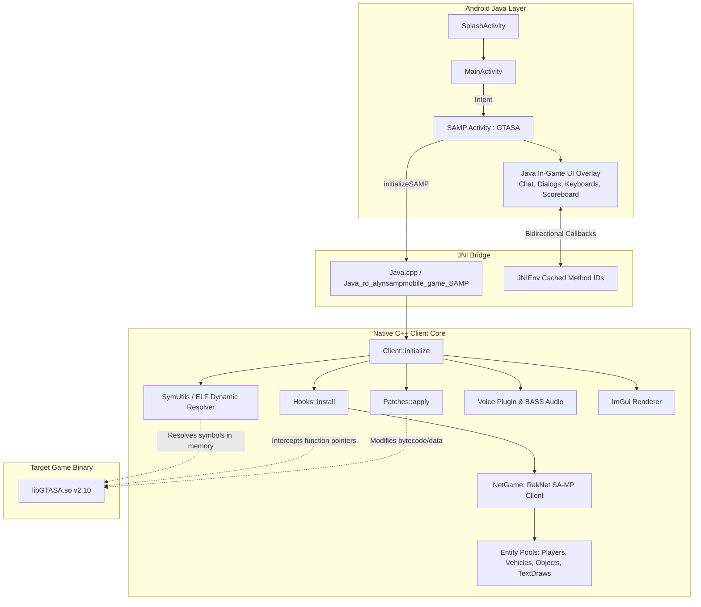

# ARCHITECTURE.md — System Architecture & Technical Specifications

This document details the architectural design, execution lifecycle, JNI communication patterns, memory hooking mechanisms, and network synchronization used in **Alyn SA-MP Mobile**.

---

## 1. High-Level Architecture Diagram



---

## 2. Execution Lifecycle & Subsystems

### 2.1 Game Startup Flow
1. **Activity Initialization**:
   - `SplashActivity` validates files and updates before routing to `MainActivity`.
   - `MainActivity` launches `ro.alynsampmobile.game.SAMP` (which inherits from `com.rockstargames.gtasa.GTASA`).
2. **Library Loading**:
   - `SAMP.loadLibraries()` executes `System.loadLibrary("GTASA")` followed by `System.loadLibrary("Alyn_SAMPMOBILE")`.
   - JNI entry point `JNI_OnLoad` caches the `JavaVM*` pointer.
3. **Hooking & Symbol Resolution**:
   - `initializeSAMP()` calls `Client::initialize()`.
   - `g_saSym->Open("libGTASA.so")` parses the ELF header and dynamic symbol tables (`.dynsym`, `.dynstr`, `.hash`) in memory.
   - `Hooks::install()` hooks crucial engine hooks:
     - `AND_TouchEvent`: Handles touch input routing between ImGui, Java widgets, and game controls.
     - `Render2dStuff` / `eglSwapBuffers`: Drives ImGui rendering and SA-MP 2D overlays.
     - `OS_FileOpen`: Redirects file loads to custom asset folders.
4. **State Polling**:
   - Background pthread monitors `*g_saSym->GetSymbol<uint32_t*>("gGameState") != 7`.
   - When the GTA engine enters game state 7 (In-Game), `pGame->StartGame()` is triggered and `Client::process()` initializes `NetGame` (or offline test mode).

---

## 3. Network Architecture (SA-MP 0.3.7 / 0.3.7-R4)

`NetGame` manages the multiplayer UDP state machine on top of a customized **RakNet** network layer.

```
NetGame (app/src/main/cpp/Alyn_SAMPMOBILE/Net/)
├── NetGame.cpp / .h       : Connection handshake, auth, packet loop, clock sync
├── NetRPC.cpp             : RPC dispatchers (Client -> Server and Server -> Client)
├── ScriptRPC.cpp          : Server-to-Client script RPCs (ShowDialog, SetPlayerPos, etc.)
└── Pools:
    ├── PlayerPool.cpp     : Remote players (CRemotePlayer) and Local player (CLocalPlayer)
    ├── VehiclePool.cpp    : Synchronization of spawned and streamed vehicles
    ├── ObjectPool.cpp     : Dynamic objects and custom materials/textures
    ├── PickupPool.cpp     : World pickups
    ├── TextDrawPool.cpp   : Server-created 2D TextDraws
    ├── TextLabelPool.cpp  : 3D Text labels attached to world/players/vehicles
    └── GangZonePool.cpp   : Territory color overlays on radar/map
```

### Player Synchronization Pipeline:
- **Local Player**: `CLocalPlayer::SendOnFootFullSyncData()` / `SendInCarFullSyncData()` serialize player animation, velocity, health/armour, weapon state, and coordinates into bitstreams sent at regular tick intervals.
- **Remote Players**: `CRemotePlayer::StoreOnFootFullSyncData()` interpolates received packets, applies matrices to the underlying `CPed` struct, and updates remote animations.

---

## 4. Voice Chat Architecture (`Voice/`)

The spatial voice system provides real-time voice streaming with 3D positional effects:
- **Capture**: Audio input recorded via Android AudioRecord / OpenSL ES, compressed using the **Opus** codec.
- **Network**: Voice packets are sent out-of-band to a dedicated voice server or embedded in SA-MP custom packets.
- **Playback**: Decoded Opus packets are routed through **BASS Audio Library** channels with spatial 3D panning (`StreamAtPlayer`, `StreamAtVehicle`, `StreamAtPoint`, `StreamAtObject`).

---

## 5. JNI Bridge Reference Table

| Java Method ([`ro.alynsampmobile.game`](file:///root/Downloads/project/alyn_samp_v17_1/app/src/main/java/ro/alynsampmobile/game)) | Native C++ Implementation ([`Java.cpp`](file:///root/Downloads/project/alyn_samp_v17_1/app/src/main/cpp/Alyn_SAMPMOBILE/Java/Java.cpp)) | Direction | Purpose |
|---|---|---|---|
| `SAMP.initializeSAMP(ui, dir, isOffline)` | `Java_ro_alynsampmobile_game_SAMP_initializeSAMP` | Java $\rightarrow$ C++ | Initializes native client engine & hooks |
| `SAMP.multiTouchEvent4Ex(...)` | `Java_ro_alynsampmobile_game_SAMP_multiTouchEvent4Ex` | Java $\rightarrow$ C++ | Passes multi-touch coordinates to game pad |
| `UI.keyboardSend(byte[] str)` | `Java_ro_alynsampmobile_game_ui_UI_keyboardSend` | Java $\rightarrow$ C++ | Sends typed text to native chat handler |
| `UI.sendDialogResponse(...)` | `Java_ro_alynsampmobile_game_ui_UI_sendDialogResponse` | Java $\rightarrow$ C++ | Transmits dialog click/input to SA-MP server |
| `UI.showDialog(id, style, title, ...)` | `Java::showDialog(...)` | C++ $\rightarrow$ Java | Opens native Android dialog dialog popup |
| `UI.showKeyboard(bool show)` | `Java::showKeyboard(...)` | C++ $\rightarrow$ Java | Toggles in-game Android virtual keyboard |
| `UI.setWantedLevel(int level)` | `Java::setWantedLevel(...)` | C++ $\rightarrow$ Java | Updates wanted stars display |

---

## 6. Memory Hooking & Symbol Resolution

The project uses runtime ELF symbol lookups rather than hardcoded static offsets wherever possible:

- **`SymUtils` ([`SymUtils.h`](file:///root/Downloads/project/alyn_samp_v17_1/app/src/main/cpp/Alyn_SAMPMOBILE/Memory/include/SymUtils.h))**:
  - Dynamically parses `libGTASA.so` to look up symbol names (e.g. `_ZN10CPlayerPed16ProcessControlEv`, `_Z12RenderScenev`, `gGameState`).
- **`Gloss` Hooking Library ([`Gloss.h`](file:///root/Downloads/project/alyn_samp_v17_1/app/src/main/cpp/Alyn_SAMPMOBILE/Memory/include/Gloss.h))**:
  - Provides ARM/ARM64 inline hook trampolines to intercept native functions and detour execution to custom handlers in [`Hooks.cpp`](file:///root/Downloads/project/alyn_samp_v17_1/app/src/main/cpp/Alyn_SAMPMOBILE/Game/Hooks.cpp).
- **`Patches` ([`Patches.cpp`](file:///root/Downloads/project/alyn_samp_v17_1/app/src/main/cpp/Alyn_SAMPMOBILE/Game/Patches.cpp))**:
  - Direct memory writing via `mprotect` to bypass game limitations (e.g. infinite run, vehicle color limits, removing singleplayer script spawns, disabling original cheats/menus).
